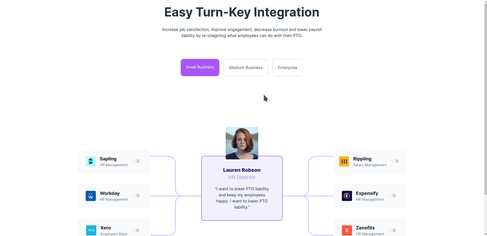

# Nexus Front-end Exam



## Objective

- Create a responsive component that matches the given figma design

Made with [ReViT](https://github.com/rabira-hierpa/revit) A React boilerplate with TypeScript, TailwindCSS and Vite.

## Installation/Usage

You can start using this repo as a template or clone the repostory and start hacking

```bash
  git clone https://github.com/rabira-hierpa/front-end-nexus-exam
  cd front-end-nexus-exam
  npm install
```

## License

[](https://choosealicense.com/licenses/mit/)

## Contributing

Contributions are always welcome!

Please feel free to contribute to the repo by opening an issue/pull request!

Happy Hacking!

## Authors

- [@rzcodes](https://www.github.com/rabira-hierpa)
